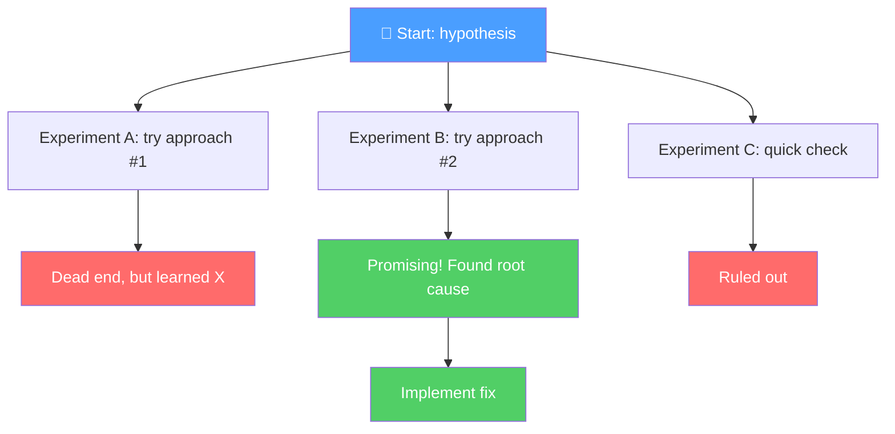
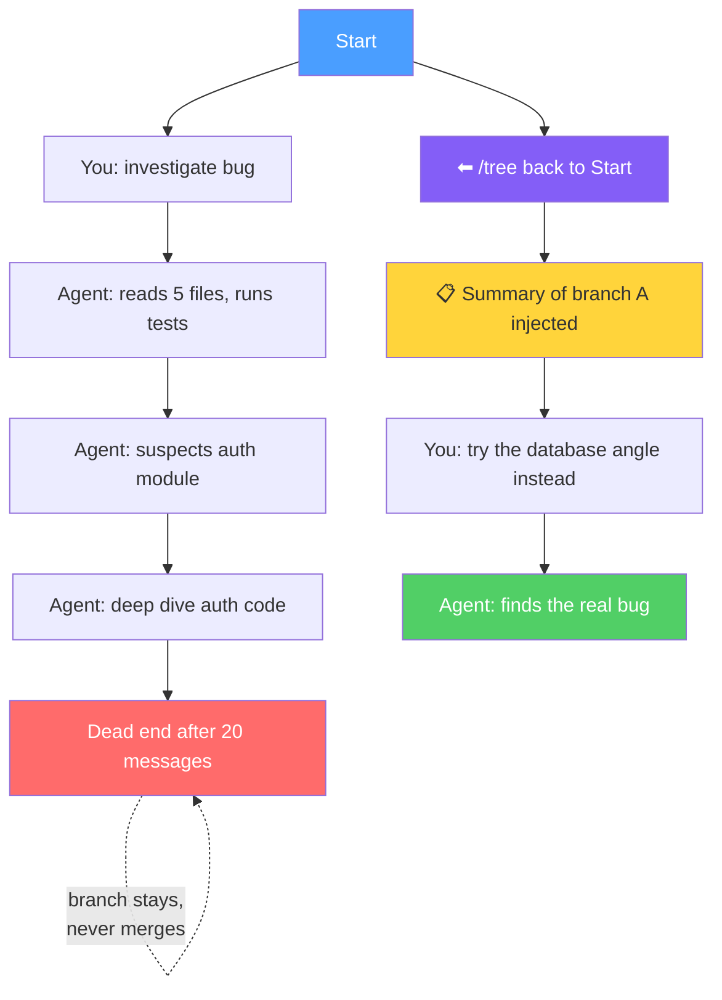

# Pi Agent: Tree, Branch, and Fork Guide

## Core Concept

Pi sessions are trees, not flat logs. Every message has an `id` and `parentId`. Your current position is the **active leaf**. You can move that leaf anywhere in the tree and continue from there.

## Mental Model: Lab Notebook

Think of a pi session as a lab notebook. You have a hypothesis, you run an experiment (branch), and write up results. If the experiment doesn't pan out, you go back to the hypothesis and try a different experiment. The experiments never merge into one experiment. But your write-ups (branch summaries) carry forward, so the next experiment benefits from what you already learned.

- **Branch** = run an experiment
- **Summary** = write-up of results (not the raw data)
- **Navigate back** = return to the hypothesis, try another approach
- **Label** = bookmark a promising checkpoint
- **Fork** = results were so interesting they became a separate research project

The notebook tracks your thinking. The actual specimens (files on disk) are managed separately (by git).

### Session tree structure

### What happens when you navigate back

The yellow node is the key: when you leave a branch, pi compresses it into a summary and injects it into your new path. You carry the insight, not the 20 messages of dead-end exploration.

## How It Maps to Git (and Where It Breaks)

If you know git branching, this maps partially:

| Git | Pi Tree |
|-----|---------|
| `branch` | Navigate to a past node, type something new |
| `checkout` | `/tree` then select a node |
| `commit message` | Label (`Shift+L` in tree viewer) |
| `squash` | Branch summarization (automatic on switch) |
| `merge` | Does not exist |
| `rebase` | Does not exist |

**There is no merge.** Branches produce knowledge (summaries) that carries forward, but conversation paths stay separate forever. You never get a unified thread containing both branches' full content.

Think of it less like git branches and more like a wiki with a "back" button. You visit pages (branches), take notes (summaries), carry the notes when you leave. The pages don't combine.

### What "going back" actually does

When you leave branch A and navigate to branch B, pi:

1. Summarizes branch A (what was discussed, what files changed)
2. Injects that summary into branch B's context
3. Moves the leaf pointer to branch B

Branch A still exists in the session file, untouched. You can `/tree` and go back anytime.

### File changes are git's job

Pi only manages conversation state. If both branches produced file changes you want to keep, use git. Commit before switching branches.

## Commands

| Command | What it does |
|---------|-------------|
| `/tree` | Opens the session tree viewer |
| `/fork` | Creates a new independent session from current one |
| `pi --fork <id>` | Fork a specific session from CLI |
| `pi -c` | Continue previous session |
| `pi -r` | Pick a session to resume |

## When to Use What

**Use `/tree` when:**
- Exploring and want to try a different direction
- Agent went down a wrong path
- Testing multiple hypotheses from the same starting point
- Cleaning up context by isolating noisy exploration

**Use `/fork` when:**
- Exploration phase is done, implementation phase starts
- A branch becomes its own project or deliverable
- Session is getting heavy and you want a fresh start with history
- Switching to a different working directory with inherited context

**Rule of thumb:** `/tree` = fast branch hopping in one workstream. `/fork` = separate mission.

## Tree Viewer Keybindings

| Key | Action |
|-----|--------|
| `Ctrl+Left` / `Alt+Left` | Fold branch or move up |
| `Ctrl+Right` / `Alt+Right` | Unfold branch or move down |
| `Shift+L` | Edit label on a node |
| `Shift+T` | Toggle timestamps |
| `Ctrl+D` | Default view |
| `Ctrl+T` | Hide tool results |
| `Ctrl+U` | User messages only |
| `Ctrl+L` | Labeled entries only |

## Branch Summarization

When you leave a branch, pi can summarize it automatically. The summary is injected into the new branch as a `branch_summary` entry. You carry the insight without the token cost.

This happens by default when navigating with `/tree`. The summary includes file operations performed and key findings.

## Workflow Patterns

### 1. Explore, Then Commit

Ask pi to investigate a problem. When you spot the right direction, label that node (`Shift+L`). If the next attempt fails, open `/tree`, navigate back to the labeled node, branch off.

### 2. Hypothesis Testing

Bug with multiple possible causes:

1. Start investigating cause A. Reach a conclusion.
2. Open `/tree`, navigate back to before the investigation.
3. Branch, investigate cause B. Reach a conclusion.
4. Repeat for cause C.
5. Navigate back to a decision point. Act on the collected evidence.

Each branch ends with one artifact: evidence for or against a hypothesis.

### 3. Context Hygiene

Keep a clean mainline for decisions and implementation. Send all noisy work (grepping, reading, dead ends) into side branches. When you return, the summary preserves what mattered.

### 4. Phase Transitions

Exploration done, ready to implement? `/fork` the session. New session inherits all context, starts clean. Old session stays as reference you can resume later.

### 5. Extension/Tool Debugging

Something breaks mid-session? Branch into a fresh context, debug, fix, then navigate back. Pi summarizes the debugging detour so you don't lose your place.

## Important Safety Notes

- **`/tree` does not manage files.** It only manages conversation state. Always use git for code rollback.
- **Commit before branching** if the agent has made file changes you want to keep.
- **Label checkpoints** before risky operations so you have named points to return to.

## Advanced: Side Agents

For true parallel work, consider [pi-side-agents](https://github.com/pasky/pi-side-agents). Spawns isolated child agents in separate tmux windows with their own git worktrees. Each child gets a topic branch, works independently, merges back on approval.

Install: `pi install git:github.com/pasky/pi-side-agents`

## References

- [Session architecture](https://pi-handbook.whatsinfor.me/04-sessions/)
- [Tree and context management](https://stacktoheap.com/blog/2026/02/26/pi-tree-context-window-management/)
- [Side agents](https://github.com/pasky/pi-side-agents)
- [Armin Ronacher's pi writeup](https://lucumr.pocoo.org/2026/1/31/pi/)
